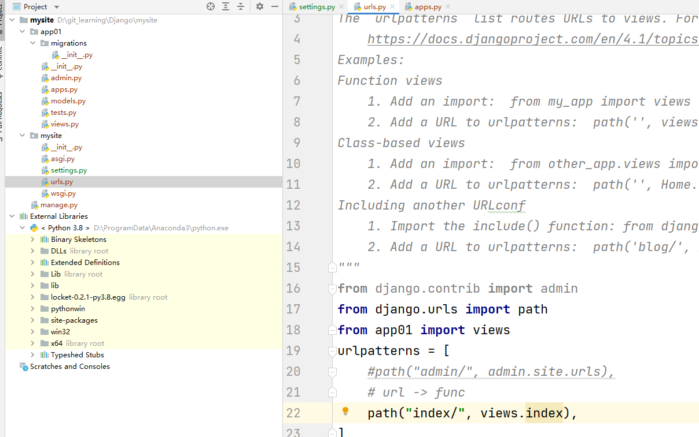

# Django
#### 创建对比
*   By Pycharm
    *   多了templates 文件夹
    *   settings.py : 'DIRS' = [os.path.join会有一个base文件目录
*   By 命令行
    *   标准

#### 默认项目文件管理
*   manage.py [项目管理]
*   asgi.py/wsgi.py [接收网络请求]
*   urls [url和python函数的对应关系] urls -> views func
*   settings[项目配置文件],比如链接数据库，注册app，域名...

### APP概念
*   项目
    * app 用户管理[表结构，函数，html模板,css]
    * app 订单管理
    * app 网站
*   app中的文件
    *   admin.py django提供admin后台管理
    *   apps.py app启动类
    *   migrations 数据库变更记录
    *   models.py 重要，对数据库进行操作 orm
    *   tests.py 单元测试
    *   views.py 视图函数

### Quick Start
*   app注册
    *   
*   编写url和视图函数的对应关系[urls.py]
    *   
*   编写视图函数 [views.py]
    * def index(request) 默认是request的变量
    * 返回HttpResponse
    * return render(request,"xxx.html")
*   python manage.py runserver 
    *   直接启动 十分迅速
    *   ctrl + c即可停止
*   html上面填写
    *   href = 
    *   是一个相对路径的使用 方便之后更改各种的配置

#### 静态文件
*   在开发过程中一般将
    *   图片
    *   CSS
    *   JS
    *   当成静态文件处理
*   在app目录下 创建 static 目录

### 模板语法
*   本质上：在html中写一些占位符，由数据对其进行替换和处理
    *   for循环及endfor
    *   if和endif elif else
*   Django开发的模板语法
    *   urls.py views.py templates[含有模板语法的html]
    *   读取html文件->内部进行渲染，模板语法并且替换数据->最终得到只包含html标签的字符串 -> 将渲染的结果返回给用户浏览器

### 请求和相应
*   csrf验证
    *   跨站请求伪造
    *   Django默认的一个作为验证的方法
    *   需要在html的form表单中里留位 {}

### 数据库操作orm
*   Django开发操作数据库更加简单，内部提供了 orm框架
*   ORM（去学学优化）
    *   帮助我们翻译 把 数据要求翻译成sql语句，然后基于自己的各类框架去做一些操作
    *   orm如何去对数据库进行增删改查
    *   things to do
        *   创建修改删除，表。创建数据库需要自己去操作
        *   操作表中的数据
    *   步骤
        *   创建数据库
        *   models.py文件进行修改
            *   需要先把app注册
            *   先执行manage.py makemigarations
            *   再执行migarate
            *   django内置里提供了一些表，也会生成一些数据库的表
            *   app_classname 表
        *   insert => objects.create
        *   delete => objects.fillter().delete()
        *   filter筛选.first()第一条数据
        *   update 更新

*   模板的继承
    *   url中可以传递值
    *   子html 先在顶部写extends '...html'
    *   
    *   不需要重新编写一些东西
    *   解耦

### Django组件
*   Form组件(小简便) 
    *   能帮自动生成html标签
*   ModelForm组件(最简便，最推荐)
    *   代码再次优化且精简
    *   修改views.py
        *   class Meta: 
            *   model = UserInfo
            *   fields = ['name','pwd','age']